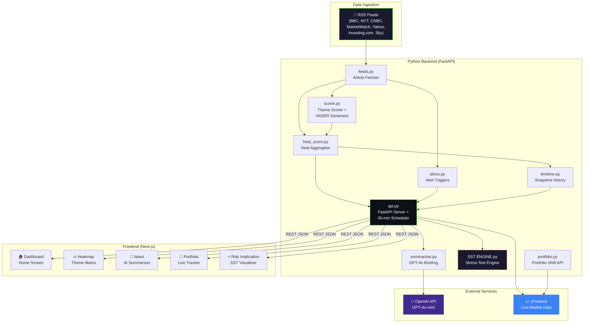
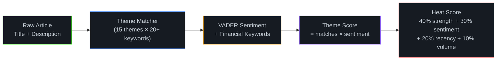
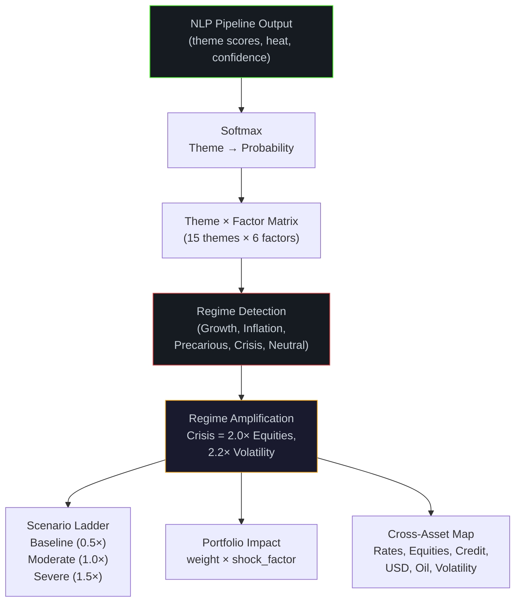
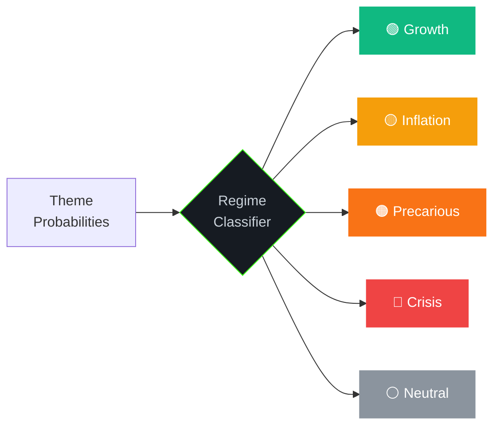
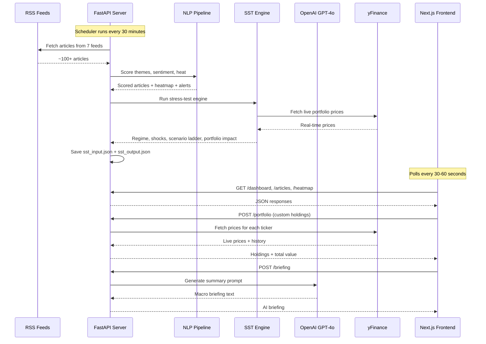

<](https://www.python.org/)
[](https://fastapi.tiangolo.com/)
[](https://nextjs.org/)
[](https://openai.com/)
[]()

</div>

---

## 📋 Table of Contents

- [Overview](#-overview)
- [System Architecture](#-system-architecture)
- [NLP Pipeline](#-nlp-pipeline)
- [SST Engine (Scenario Stress-Test)](#-sst-engine-scenario-stress-test)
- [Frontend Dashboard](#-frontend-dashboard)
- [Data Flow](#-end-to-end-data-flow)
- [Macro Themes](#-macro-themes)
- [API Reference](#-api-reference)
- [Project Structure](#-project-structure)
- [Getting Started](#-getting-started)
- [Environment Variables](#-environment-variables)
- [Tech Stack](#-tech-stack)

---

## 🔭 Overview

MARSS is a full-stack **macro-financial surveillance platform** that:

1. **Ingests** live financial news from 7 RSS feeds (BBC, NYT, CNBC, MarketWatch, Yahoo Finance, Investing.com, Sky News)
2. **Classifies** each article against **15 macro themes** (e.g. Inflation Shock, Recession Risk, Geopolitical Escalation) using keyword-based NLP and VADER sentiment analysis
3. **Computes** a multi-factor **heat score** per theme that combines sentiment intensity, theme strength, recency, and volume
4. **Runs** a quantitative **Scenario Stress-Test (SST) Engine** that translates theme probabilities into cross-asset shock vectors, detects macro regimes, and maps impacts onto a live portfolio
5. **Generates** AI-powered daily briefings via GPT-4o-mini
6. **Visualizes** everything in a real-time Next.js dashboard with live polling, interactive heatmaps, and portfolio tracking via yFinance

---

## 🏛️ System Architecture



---

## 🧠 NLP Pipeline

The NLP pipeline processes raw news articles through four scoring stages:



### Scoring Components

| Component | Module | Description |
|-----------|--------|-------------|
| **Theme Matching** | `scorer.py` | Counts keyword matches per theme from `themes.py` (15 themes × 20+ keywords each) |
| **Sentiment** | `scorer.py` | Blends VADER compound score (60%) with financial keyword intensity (40%) |
| **Confidence** | `scorer.py` | 70% peak match strength + 30% average match strength |
| **Theme Strength** | `scorer.py` | 60% average keyword matches + 40% peak matches, normalized to [0, 1] |
| **Recency** | `heat_score.py` | Stepped decay: 1.0 (< 6h) → 0.8 (< 24h) → 0.6 (< 3d) → 0.4 (< 7d) → 0.2 |
| **Heat Score** | `heat_score.py` | Weighted composite: 40% strength + 30% sentiment + 20% recency + 10% volume |

### Alert System

`alerts.py` monitors for critical phrases across 5 categories:

- **Geopolitical** — "declares war", "missile attack", "invasion begins" …
- **Monetary** — "emergency rate cut", "surprise rate hike", "Fed intervenes" …
- **Banking** — "bank failure", "bank collapse", "FDIC seizure" …
- **Market** — "circuit breaker", "trading halted", "market crash" …
- **Energy** — "oil embargo", "pipeline explosion", "Strait of Hormuz closed" …

---

## ⚡ SST Engine (Scenario Stress-Test)

The SST Engine (`SST ENGINE.py`) is a quantitative scenario analysis system that converts macro theme signals into actionable cross-asset shock vectors.



### 6 Cross-Asset Factors

| Factor | Examples | Description |
|--------|----------|-------------|
| **Rates** | TLT, IEF, BND | Interest rate / yield sensitivity |
| **Equities** | SPY, QQQ, AAPL | Equity market beta |
| **Credit Spreads** | HYG, LQD, JNK | Corporate credit risk |
| **USD** | UUP, DXY | Dollar strength exposure |
| **Oil** | USO, XLE | Energy / commodity sensitivity |
| **Volatility** | VIXY, VXX | Implied volatility exposure |

### Regime Detection

The engine detects 5 macro regimes, each with distinct amplification multipliers:



| Regime | Trigger Conditions | Equities Multiplier | Volatility Multiplier |
|--------|-------------------|---------------------|-----------------------|
| **Growth** | High Growth Reacceleration + Risk On + Easing | 1.4× | 1.1× |
| **Inflation** | High Inflation Shock + Tightening + Energy Shock | 1.1× | 1.0× |
| **Precarious** | High Recession Risk + Growth Slowdown + Credit Crunch | 1.4× | 1.4× |
| **Crisis** | Risk Off + Volatility Shock + Credit Crunch + Banking | 2.0× | 2.2× |
| **Neutral** | No dominant signal (best score < 0.2) | 1.0× | 1.0× |

### Theme → Factor Shock Matrix (excerpt)

| Theme | Rates | Equities | Credit | USD | Oil | Volatility |
|-------|-------|----------|--------|-----|-----|------------|
| Inflation Shock | +2.0 | −1.0 | +1.0 | +1.0 | +1.0 | +1.0 |
| Recession Risk | −2.0 | −3.0 | +3.0 | +1.0 | −2.0 | +3.0 |
| Energy Shock | +1.0 | −1.0 | +1.0 | +0.5 | +3.0 | +1.0 |
| Geopolitical Escalation | 0 | −1.5 | +1.2 | +0.8 | +2.5 | +1.8 |
| Risk On | +1.0 | +3.0 | −2.0 | −1.0 | +1.0 | −2.0 |

---

## 🖥️ Frontend Dashboard

The Next.js frontend provides 5 interactive pages, all with **live data polling** (30s–60s intervals) and automatic fallback to mock data when the backend is unreachable.

### Pages

| Page | Route | Description |
|------|-------|-------------|
| **Home Screen** | `/` | Portfolio snapshot, AI briefing, live article feed with per-article portfolio shift, alert ticker |
| **Macro Heatmap** | `/heatmap` | Theme heat matrix (30D/7D/24H + daily columns), SST probability distribution chart, economic event timeline |
| **News Summarizer** | `/news` | Full article feed with search, theme filters, sentiment badges, relevance scoring, theme frequency sidebar |
| **Portfolio Tracker** | `/portfolio` | Live stock prices via yFinance, holdings table with sparklines, sector + asset class allocation, 52-week ranges, day movers, customizable portfolio (persisted to localStorage) |
| **Risk Implication** | `/risk-implication` | SST Engine visualizer: regime badge, cross-asset impact bar chart, portfolio impact breakdown, scenario ladder table (baseline / moderate / severe) |

### Key Frontend Features

- **Live Status Badge** — pulsing indicator showing connection state, last update time, and manual refresh
- **Smart Fallback** — graceful degradation to mock data when backend is offline
- **Custom Portfolio** — add/remove tickers persisted to `localStorage`, synced across all pages via `portfolioUpdated` events
- **Portfolio Shift** — click any article to see how your portfolio moved since that article was published

---

## 🔄 End-to-End Data Flow



---

## 🏷️ Macro Themes

MARSS tracks **15 macroeconomic themes**, each defined by 17–30+ keyword triggers:

| # | Theme | Sample Keywords |
|---|-------|----------------|
| 1 | **Inflation Shock** | inflation, CPI, PCE, tariffs, price surge, PPI |
| 2 | **Disinflation** | disinflation, inflation cooling, CPI decline |
| 3 | **Energy Shock** | oil prices, OPEC, Brent crude, WTI, pipeline disruption |
| 4 | **Growth Slowdown** | GDP slows, PMI contraction, weak data, stagnation |
| 5 | **Recession Risk** | recession, GDP contraction, inverted yield curve, layoffs |
| 6 | **Growth Reacceleration** | GDP beats, strong growth, soft landing, upside surprise |
| 7 | **Monetary Tightening** | rate hike, hawkish Fed, QT, higher for longer |
| 8 | **Monetary Easing** | rate cut, dovish Fed, QE, pivot, accommodative policy |
| 9 | **Banking Stress** | bank failure, bank run, FDIC, contagion, SVB |
| 10 | **Credit Crunch** | credit crunch, loan defaults, credit spreads widen, junk bonds |
| 11 | **Geopolitical Escalation** | war, sanctions, invasion, trade war, nuclear threat |
| 12 | **Dollar Strength** | strong dollar, DXY, USD rally, greenback, EM pressure |
| 13 | **Risk Off** | flight to safety, sell off, VIX, panic selling, safe haven |
| 14 | **Risk On** | rally, stocks surge, bull market, risk appetite |
| 15 | **Volatility Shock** | VIX spike, volatility surge, wild swings, whipsaw |

---

## 📡 API Reference

### Core Endpoints

| Method | Endpoint | Description |
|--------|----------|-------------|
| `GET` | `/` | Health check — returns `{"status": "Macro NLP Engine Running"}` |
| `GET` | `/dashboard` | Full dashboard payload: heatmap, alerts, timeline, SST output |
| `GET` | `/heatmap` | Aggregated theme heat scores |
| `GET` | `/articles` | Scored articles with themes, sentiment, heat, confidence |
| `GET` | `/alerts` | Triggered alert phrases |
| `GET` | `/timeline` | Historical heat score snapshots |
| `GET` | `/snapshot` | Force-save a new timeline snapshot |
| `GET` | `/sst` | Latest SST Engine output (regime, shocks, portfolio impact) |

### Portfolio Endpoints

| Method | Endpoint | Description |
|--------|----------|-------------|
| `POST` | `/portfolio` | Fetch live prices + holdings for given portfolio (body: `[{ticker, name, quantity, sector}]`) |
| `POST` | `/portfolio/shift` | Compute portfolio shift since a timestamp (body: `{timestamp, items}`) |
| `POST` | `/briefing` | Generate AI macro briefing for portfolio (body: portfolio items array) |

---

## 📁 Project Structure

```
mars/
├── api.py                  # FastAPI server — all REST endpoints + 30-min scheduler
├── feeds.py                # RSS feed ingestion (7 sources)
├── scorer.py               # Theme scoring + VADER sentiment + confidence
├── heat_score.py           # Per-article and per-theme heat computation
├── themes.py               # 15 macro themes × keyword definitions
├── alerts.py               # Critical phrase alert triggers
├── timeline.py             # Snapshot persistence to timeline.json
├── summarizer.py           # GPT-4o-mini briefing generator
├── portfolio.py            # Portfolio shift micro-API
├── SST ENGINE.py           # Scenario Stress-Test engine (regime, shocks, ladder)
├── main.py                 # CLI runner for NLP pipeline
│
├── sst_input.json          # NLP pipeline output → SST input (auto-generated)
├── sst_output.json         # SST engine results (auto-generated)
├── timeline.json           # Heat score snapshots history (auto-generated)
├── current_portfolio.json  # Active portfolio (auto-generated)
│
├── requirements.txt        # Python dependencies
├── package.json            # Node.js dependencies
├── .env.example            # Environment variable template
│
└── src/                    # Next.js frontend
    ├── app/
    │   ├── page.tsx            # Home dashboard
    │   ├── layout.tsx          # Root layout + sidebar
    │   ├── globals.css         # Design system + theme
    │   ├── heatmap/page.tsx    # Macro theme heatmap
    │   ├── news/page.tsx       # AI news summarizer
    │   ├── portfolio/page.tsx  # Portfolio tracker
    │   └── risk-implication/page.tsx  # SST engine visualizer
    ├── components/
    │   ├── Sidebar.tsx         # Navigation sidebar
    │   ├── LiveStatusBadge.tsx # Connection status indicator
    │   └── MiniSparkline.tsx   # Inline sparkline charts
    ├── hooks/
    │   └── usePolling.ts       # Generic polling hook with error handling
    ├── lib/
    │   └── api.ts              # API client, types, data transformers
    └── data/
        └── mockData.ts         # Fallback mock data for offline mode
```

---

## 🚀 Getting Started

### Prerequisites

- **Python** 3.10+
- **Node.js** 18+
- **npm** or **yarn**

### 1. Clone the Repository

```bash
git clone https://github.com/KriegerBlitz/MARSSTrackerPro.git
cd MARSSTrackerPro
```

### 2. Backend Setup

```bash
# Create and activate virtual environment
python -m venv .venv
source .venv/bin/activate  # Linux/Mac
# .venv\Scripts\activate   # Windows

# Install dependencies
pip install -r requirements.txt

# Copy environment variables
cp .env.example .env
# Edit .env and set your OPENAI_API_KEY
```

### 3. Frontend Setup

```bash
npm install
```

### 4. Run the Application

**Terminal 1 — Start the FastAPI backend:**

```bash
uvicorn api:app --reload --host 0.0.0.0 --port 8000
```

**Terminal 2 — Start the Next.js frontend:**

```bash
npm run dev
```

Open [http://localhost:3000](http://localhost:3000) to view the dashboard.

### 5. Seed Initial Data (Optional)

Run the NLP pipeline manually to populate `sst_input.json` and `sst_output.json`:

```bash
python main.py
```

> **Note:** The FastAPI server automatically runs the full pipeline (NLP + SST Engine) every 30 minutes via APScheduler. The first run occurs when the server processes a `/dashboard` or `/articles` request.

---

## 🔐 Environment Variables

| Variable | Required | Description |
|----------|----------|-------------|
| `OPENAI_API_KEY` | Optional | OpenAI API key for GPT-4o-mini briefings. Falls back to rules-based summaries if unset. |
| `NEXT_PUBLIC_API_URL` | Optional | Backend URL override (default: `http://localhost:8000`) |

---

## 🛠️ Tech Stack

### Backend
- **FastAPI** — High-performance async API framework
- **VADER Sentiment** — Financial text sentiment analysis
- **NumPy / Pandas** — Numerical computation for SST Engine
- **APScheduler** — Background pipeline scheduling (30-min interval)
- **yFinance** — Real-time stock prices and historical data
- **OpenAI SDK** — GPT-4o-mini for macro briefing generation
- **BeautifulSoup4 + lxml** — RSS feed XML parsing

### Frontend
- **Next.js 15** — React framework with App Router
- **Recharts** — Interactive charts and bar graphs
- **Tailwind CSS 4** — Utility-first CSS framework
- **TypeScript** — Type-safe frontend code

---

<div align="center">

**Built for macro-aware portfolio risk management.**

</div>
]]>
